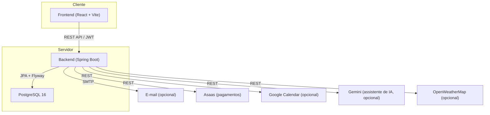
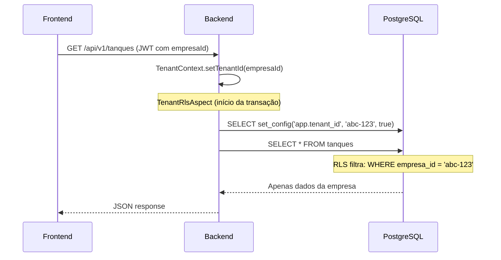

# Arquitetura — AquaManager

## Visão Geral

O AquaManager é uma aplicação SaaS multi-tenant composta por:

- **Backend**: API REST em Java/Spring Boot (Clean Architecture pragmática: Controller → Service → Repository → Entity, com DTO Pattern e portas/gateways para integrações externas)
- **Frontend**: SPA em React/TypeScript
- **Banco de dados**: PostgreSQL com isolamento multi-tenant em duas camadas
- **Infraestrutura**: Docker Compose orquestrando 3 serviços



---

## Multi-Tenancy

O isolamento entre empresas (tenants) usa **duas camadas independentes de defesa**:

1. **Filtro Hibernate** (`@Filter` em `TenantAwareEntity`): toda consulta em entidade tenant-aware ganha automaticamente `WHERE empresa_id = :tenantId`, habilitado no início de cada transação.
2. **Row-Level Security do PostgreSQL** (`V18__row_level_security.sql`): mesmo que uma query esqueça o filtro do Hibernate, o próprio banco recusa linhas de outra empresa.

Ambas as camadas são ativadas pelo mesmo mecanismo: `TenantRlsAspect` intercepta métodos `@Transactional` e, via `TenantSessionManager`, executa `SELECT set_config('app.tenant_id', ...)` (para o RLS) e `session.enableFilter(...)` (para o Hibernate) usando o `empresaId` do `TenantContext` (ThreadLocal, populado pelo `JwtAuthenticationFilter` a partir do JWT).

**Exceções deliberadas:**
- `usuarios`, `refresh_tokens`, `login_logs`, `password_reset_tokens`, `email_confirmation_tokens`: não recebem RLS — são tabelas de fronteira de autenticação, consultadas por e-mail/token *antes* de o tenant ser conhecido (ex.: login).
- `especies`: catálogo global (`empresa_id IS NULL`) + espécies customizadas por empresa; estende `BaseEntity` (não `TenantAwareEntity`) e usa uma policy de RLS que libera `empresa_id IS NULL OR empresa_id = tenant atual`.
- `empresas`/`assinaturas`: possuem uma policy de `INSERT` permissiva, porque o cadastro cria a empresa *antes* de o contexto de tenant existir (bootstrap) — ver `EmpresaServiceImpl.criarComTrial`.
- Jobs internos genuinamente cross-tenant (expiração de trial, motor de alertas, snapshot diário do índice de saúde) usam `TenantSessionManager.runAsSystem(...)`, que ativa uma variável de sessão de bypass (`app.bypass_tenant_check`) só para essas rotinas — nunca alcançável a partir de uma requisição HTTP.



---

## Backend

### Estrutura de pacotes

```
com.aquamanager/
├── config/            # Beans de configuração (CORS, OpenAPI, Security, JWT, Asaas, e-mail, tenant)
├── modules/
│   ├── auth/          # Registro, login, JWT, refresh, 2FA, password reset, usuários
│   ├── tenant/         # Empresas, planos, assinaturas, billing (Asaas/mock)
│   ├── tanque/         # CRUD tanques + fotos
│   ├── lote/           # Lotes de peixes
│   ├── especie/        # Espécies (catálogo global + customizado) com parâmetros ideais
│   ├── alimentacao/    # Registros de alimentação
│   ├── qualidadeagua/  # Medições de qualidade da água
│   ├── crescimento/    # Biometrias e crescimento (biomassa calculada no backend)
│   ├── mortalidade/    # Registros de mortalidade (ajusta quantidadeAtual do lote)
│   ├── fornecedor/      # Fornecedores
│   ├── cliente/         # Clientes compradores
│   ├── estoque/         # Itens + movimentações de estoque
│   ├── financeiro/      # Lançamentos financeiros (receitas/despesas), DRE simplificado
│   ├── alerta/          # Motor de alertas automáticos (scan periódico por empresa)
│   ├── saude/           # Índice de saúde por tanque (cálculo + snapshot diário)
│   ├── dashboard/        # Agregações para o dashboard
│   ├── agenda/            # Calendário de eventos + sincronização Google Calendar (OAuth)
│   ├── relatorio/         # Geração de relatórios PDF/Excel
│   └── assistente/        # Assistente de IA (Gemini), com contexto isolado por tenant
└── shared/
    ├── domain/         # BaseEntity, TenantAwareEntity, Role, Exceptions
    ├── application/    # Portas (EmailSender)
    └── infrastructure/
        ├── email/       # ConsoleEmailSender, SmtpEmailSender
        ├── persistence/ # TenantContext, TenantRlsAspect, TenantSessionManager
        ├── security/    # JWT, AuthenticatedUser, RateLimiter, TokenHasher, SecurityUtils
        └── web/         # ApiResponse, ApiError, GlobalExceptionHandler, PageResponse
```

### Padrão por módulo

Cada módulo segue a mesma estrutura interna:

```
modules/<modulo>/
├── application/
│   ├── dto/           # Request/Response DTOs (records)
│   ├── port/          # Interfaces de porta (gateways externos, quando aplicável)
│   └── *Service.java  # Interface + implementação (regra de negócio aqui, nunca no controller)
├── domain/
│   └── *.java         # Entidades JPA
└── infrastructure/
    ├── mapper/         # Mapeamento Entity→DTO (MapStruct em tenant/auth; manual nos demais
    │                   # módulos, por simplicidade em conversões com enums/relações)
    ├── persistence/     # Spring Data repositories
    └── web/             # REST controllers (finos — delegam ao service)
```

### Segurança

| Mecanismo | Implementação |
|---|---|
| Autenticação | JWT (access token em memória no frontend + refresh token opaco em cookie httpOnly, rotacionado a cada uso) |
| Autorização | Spring Security + `@PreAuthorize` com roles (RBAC) |
| 2FA | TOTP (RFC 6238, implementação própria com `javax.crypto`) + QR Code via ZXing |
| OAuth (Google Calendar) | `state` assinado com HMAC-SHA256 e expiração de 10 min (`OAuthStateSigner`) — evita CSRF/confused-deputy no callback público |
| Rate Limiting | `RateLimiter` em memória (janela fixa) nos endpoints de login/registro/reset de senha |
| Password Hashing | BCrypt (custo 12) |
| Token Hashing | SHA-256 para refresh tokens e tokens de reset/confirmação (nunca armazenados em texto plano) |
| CORS | Configurável via env, `credentials: true` |
| Isolamento multi-tenant | Filtro Hibernate + Row-Level Security (ver seção acima) |
| Cabeçalhos de segurança | `X-Content-Type-Options`, `X-Frame-Options`, `Referrer-Policy` (backend e nginx do frontend) |

### `spring.jpa.open-in-view: true`

Decisão deliberada, diferente do "melhor prática" mais comum de desativar OSIV: os mappers de vários módulos (`TanqueMapper.fotos`, `LoteMapper.tanqueNome/especieNome`, `LancamentoMapper.clienteNome/fornecedorNome`, `EstoqueItemMapper.fornecedorNome`, etc.) acessam associações `@ManyToOne`/`@OneToMany` **LAZY** na camada de apresentação, fora da transação do service. Com OSIV desativado essas leituras lançam `LazyInitializationException`. A alternativa correta a longo prazo é mapear para DTO dentro de cada service (dentro da transação) ou usar `@EntityGraph`/`JOIN FETCH` por repositório — mas isso exigiria tocar em todos os módulos. OSIV=true resolve de forma uniforme, ao custo de manter a conexão JDBC associada à requisição por mais tempo; aceitável na escala atual e documentado aqui para revisão futura.

### Migrations (Flyway)

22 migrations versionadas (`V1` a `V22`), uma por concern: extensões, planos (seed), empresas, usuários/auth, assinaturas, espécies (seed), tanques, lotes, alimentação, qualidade da água, crescimento, mortalidade, fornecedores/clientes, estoque, financeiro, alertas, índice de saúde, Row-Level Security, colunas `updated_at` faltantes, agenda/eventos, e integração Google (`google_refresh_token` em `usuarios`).

---

## Frontend

### Stack

- **React 18** com TypeScript strict
- **Vite 6** (bundler) + **vite-plugin-pwa**
- **TailwindCSS 3** + **Radix UI** (componentes acessíveis, estilo shadcn/ui)
- **TanStack Query** (cache e sincronização de dados)
- **Zustand** (estado global mínimo: auth + UI, com persistência seletiva)
- **React Hook Form** + **Zod** (formulários com validação)
- **Recharts** (gráficos no dashboard e nos detalhes de tanque)
- **Framer Motion** (animações)
- **Axios** (HTTP client com interceptors para refresh de JWT)

### Estrutura

```
src/
├── app/
│   ├── layout/        # AppShell, Sidebar, Topbar, nav-config
│   ├── providers/      # QueryProvider, ThemeProvider
│   └── routes/          # AppRoutes, ProtectedRoute, RoleGuard
├── components/
│   ├── ui/              # 22 primitivos (Button, Card, Dialog, Table, Textarea, ...)
│   └── shared/           # ConfirmDialog, DataTablePagination, EmptyState, PageHeader, StatCard
├── features/             # 19 feature modules
│   └── <feature>/
│       ├── api/          # Funções de API (axios)
│       ├── components/    # Componentes específicos (FormDialog, etc.)
│       ├── pages/          # Páginas (lazy-loaded)
│       └── schemas/        # Schemas Zod
├── hooks/                 # Custom hooks (useAuth, useAuthBootstrap)
├── lib/                    # api-client (interceptors, refresh), utils
├── stores/                 # Zustand stores (auth-store, ui-store)
└── types/                   # Tipos globais (api, auth)
```

### Autenticação no frontend

1. Access token fica **apenas em memória** (Zustand, nunca localStorage) — mitiga XSS
2. Refresh token é um **cookie httpOnly** (`Secure`, `SameSite=Strict`) — inacessível ao JavaScript
3. Ao carregar o app, `useAuthBootstrap` faz `POST /auth/refresh` silenciosamente para restaurar a sessão
4. Interceptor do Axios detecta 401, tenta refresh uma vez, e reexecuta a request original
5. Múltiplas requests concorrentes que recebem 401 compartilham a mesma Promise de refresh (evita corrida)

### Roteamento

- **Lazy loading** com `React.lazy` + `Suspense` em todas as páginas (code-splitting automático por rota)
- **ProtectedRoute**: redireciona para `/login` se não autenticado
- **RoleGuard**: restringe acesso por role (`ADMINISTRADOR`, `GERENTE`, etc.)

---

## Infraestrutura

### Docker Compose

3 serviços:

| Serviço | Imagem | Porta |
|---|---|---|
| `postgres` | postgres:16-alpine | 5432 |
| `backend` | Build custom (JDK 17, multi-stage) | 8080 |
| `frontend` | Build custom (Node → nginx, multi-stage) | 5173→80 |

### Health checks

- PostgreSQL: `pg_isready`
- Backend: `/actuator/health` (indicador de e-mail desativado explicitamente — ver `management.health.mail.enabled: false` — para não depender de SMTP configurado)
- Frontend depende do backend estar de pé

---

## Decisões técnicas relevantes

1. **RLS + filtro Hibernate**: duas camadas independentes — mesmo um bug de código que esqueça o filtro não vaza dados entre empresas, porque o banco também recusa.
2. **`open-in-view: true`**: ver seção dedicada acima — decisão pragmática dado o padrão de mapeamento adotado nos módulos.
3. **Access token em memória**: mais seguro que localStorage contra XSS, com tradeoff de perder o token (não a sessão) ao fechar a aba — resolvido pelo refresh via cookie no boot do app.
4. **State assinado no OAuth do Google**: o callback (`/integracoes/google/callback`) é necessariamente público (é o navegador redirecionado pelo Google, sem Bearer token) — a segurança do fluxo depende inteiramente do `state` HMAC-assinado e com expiração curta.
5. **Recursos por plano**: features como o assistente de IA são gateadas no backend (`Plano.possuiRecurso("ia")`), não apenas escondidas na UI — a checagem real acontece no service.
6. **Feature-based structure**: cada domínio (backend e frontend) é auto-contido (api/domain/application/infrastructure ou api/components/pages/schemas).
